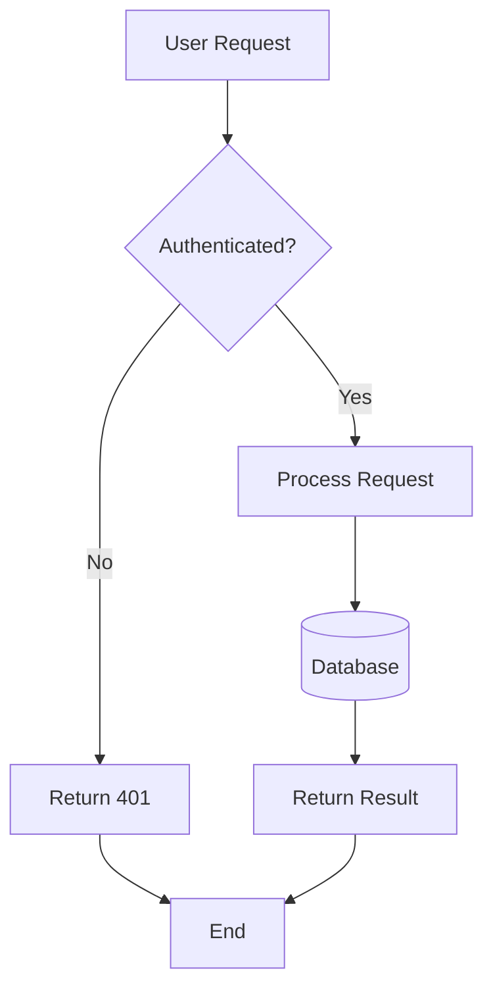
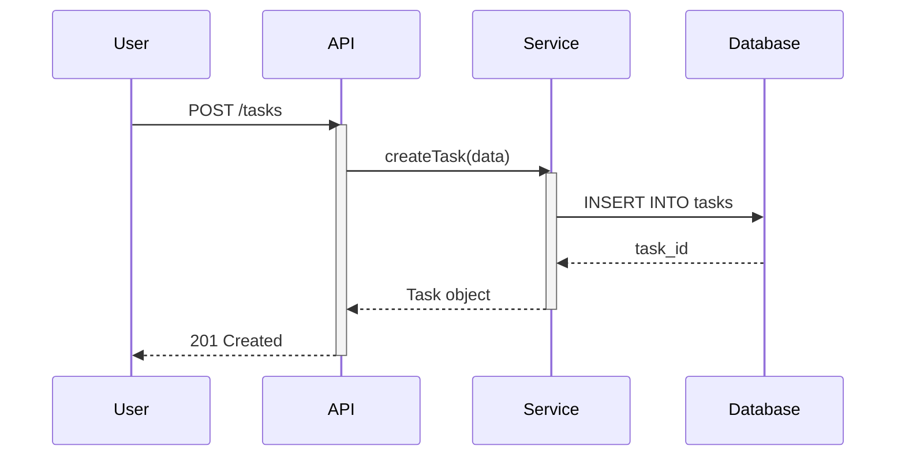
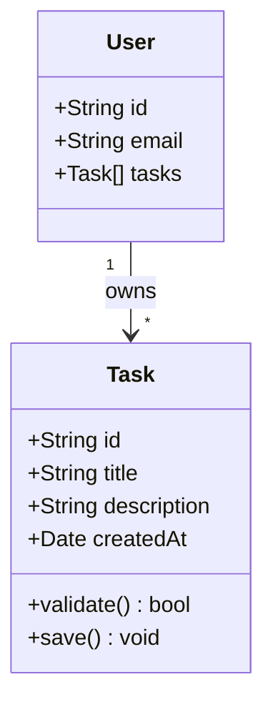
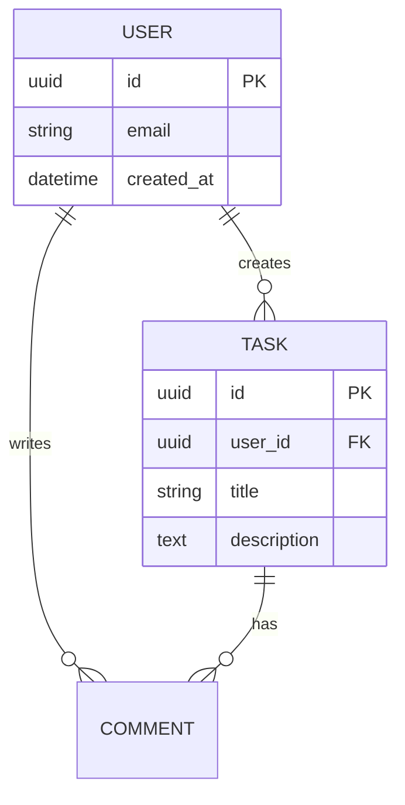
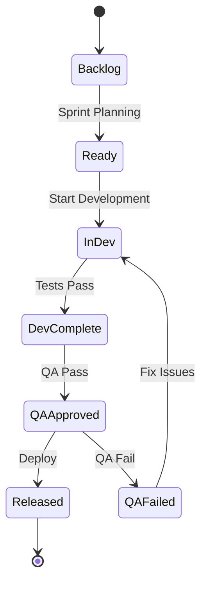
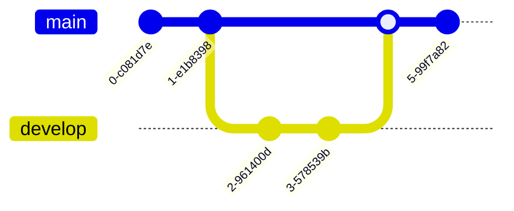
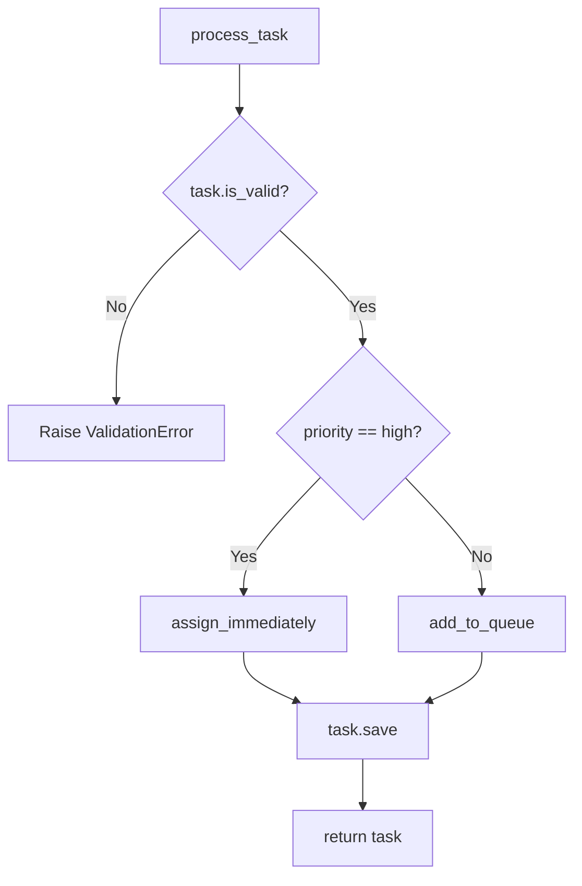
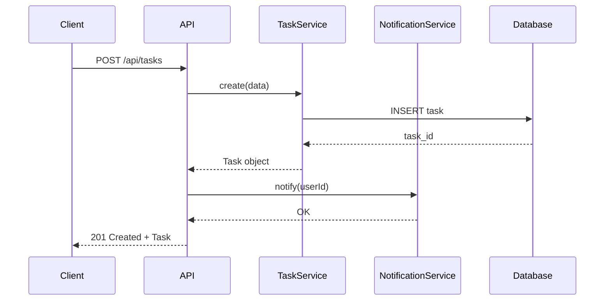
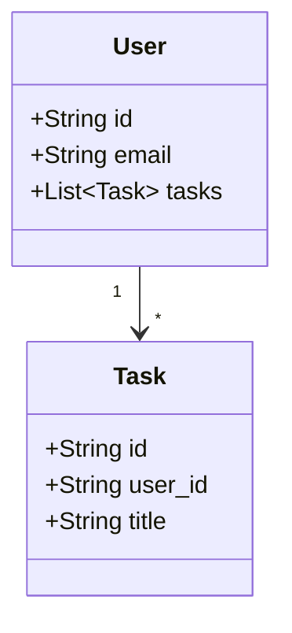

# Diagram Generation Guide

Comprehensive guide for generating Mermaid diagrams from code and specifications.

---

## Purpose

Guide the devforgeai-documentation skill in generating accurate, readable Mermaid diagrams that visualize architecture, workflows, and data flows.

---

## Mermaid Diagram Types

### 1. Flowcharts (Application Flow)

**Use for:** Control flow, algorithm visualization, decision trees

**Syntax:**


**Node Shapes:**
- `[Rectangle]` - Process/step
- `{Diamond}` - Decision point
- `([Rounded])` - Start/end
- `[(Database)]` - Data store
- `[[Subroutine]]` - Module/service

**Best Practices:**
- Limit to 15-20 nodes (split complex flows)
- Use descriptive labels (not "Step 1", "Step 2")
- Show all paths (including error paths)
- Indicate async operations with dashed lines: `-.->`

---

### 2. Sequence Diagrams (Interaction Flow)

**Use for:** API calls, component interactions, time-sequenced workflows

**Syntax:**


**Best Practices:**
- List all participants explicitly
- Use `activate`/`deactivate` to show active periods
- Use `-->>` for responses, `->>` for requests
- Add notes for important details: `Note over API: Validates input`
- Show error flows with alt blocks

---

### 3. Class Diagrams (OOP Structure)

**Use for:** Domain models, class hierarchies, relationships

**Syntax:**


**Relationship Types:**
- `-->` : Association
- `--|>` : Inheritance
- `--*` : Composition
- `--o` : Aggregation

---

### 4. ER Diagrams (Database Schema)

**Use for:** Database relationships, entity models

**Syntax:**


**Cardinality:**
- `||--||` : One to one
- `||--o{` : One to many
- `}o--o{` : Many to many

---

### 5. State Diagrams (State Machines)

**Use for:** Workflow states, story lifecycle, deployment states

**Syntax:**


---

### 6. Git Graph (Branch Strategy)

**Use for:** Version control workflows, release strategies

**Syntax:**


---

## Generating Diagrams from Code

### Flowchart from Function

**Input:** Function with control flow
```python
def process_task(task):
    if not task.is_valid():
        raise ValidationError()

    if task.priority == "high":
        task.assign_immediately()
    else:
        task.add_to_queue()

    task.save()
    return task
```

**Generated Diagram:**


---

### Sequence from API Endpoint

**Input:** API endpoint implementation
```typescript
// POST /api/tasks
async createTask(req, res) {
    const data = req.body;
    const task = await taskService.create(data);
    await notificationService.notify(task.userId);
    res.status(201).json(task);
}
```

**Generated Diagram:**


---

### Class Diagram from Domain Models

**Input:** Entity classes
```python
class User:
    id: str
    email: str
    tasks: List[Task]

class Task:
    id: str
    user_id: str
    title: str
```

**Generated Diagram:**


---

## Diagram Validation

### Syntax Validation

**Common errors to check:**

1. **Missing semicolons** (flowchart arrows)
   ```
   ❌ A --> B
   ✅ A --> B;
   ```

2. **Unescaped quotes in labels**
   ```
   ❌ A[User's Request]
   ✅ A["User's Request"]
   ```

3. **Invalid arrow syntax**
   ```
   ❌ A -> B (sequence diagram)
   ✅ A->>B
   ```

4. **Missing participant declaration**
   ```
   ❌ User->>API (participant not declared)
   ✅ participant User
       participant API
       User->>API
   ```

### Auto-Fix Procedures

**Fix 1: Add missing semicolons**
```
IF flowchart AND line matches "-->|.*[^;]$":
    line += ";"
```

**Fix 2: Escape quotes**
```
IF label contains single quote:
    Replace with escaped: \\'
    OR wrap in double quotes: "User's Request"
```

**Fix 3: Fix arrow syntax**
```
Pattern replacements:
- " -> " → " --> " (flowchart)
- "A-B" → "A-->B" (missing arrow)
```

---

## Architecture Constraint Validation

### Validate Against architecture-constraints.md

**Check for forbidden dependencies:**

```
Read("devforgeai/specs/context/architecture-constraints.md")

Extract forbidden patterns:
- "Domain → Infrastructure" (forbidden)
- "Presentation → Infrastructure" (should go through Application)

FOR each arrow in diagram:
    IF arrow represents forbidden dependency:
        Flag as violation:
        "Diagram shows Domain → Infrastructure (forbidden by architecture-constraints.md)"

        Options:
        - Fix diagram (remove arrow)
        - Fix code (remove dependency)
        - Create ADR (document exception)
```

**Validate layer boundaries:**
```
IF architecture_pattern == "Clean Architecture":
    Valid dependencies:
    - Presentation → Application ✅
    - Application → Domain ✅
    - Infrastructure → Domain (via interfaces) ✅

    Invalid dependencies:
    - Domain → Application ❌
    - Domain → Infrastructure ❌
    - Presentation → Infrastructure ❌

Check diagram for invalid arrows
```

---

## Diagram Embedding

### In Markdown Files

**Embed directly:**
```markdown
## Architecture

The system follows Clean Architecture:

`` `mermaid
flowchart TD
    ...
`` `
```

**Reference external file:**
```markdown
## Architecture

See architecture diagram: [architecture.mmd](diagrams/architecture.mmd)
```

### In Separate Files

**Create diagram file:**
```
Write(
    file_path="docs/diagrams/{name}.mmd",
    content="{mermaid_code}"
)
```

**Reference from main doc:**
```markdown

```

---

## Rendering Validation

### Verify Diagrams Render

**Method 1: Mermaid CLI** (if installed)
```bash
mmdc -i diagram.mmd -o diagram.png
```

**Method 2: Mermaid Live Editor**
```
Display: "Validate diagram at: https://mermaid.live/"
Display: "Copy diagram code and paste to verify rendering"
```

**Method 3: GitHub/GitLab Preview**
```
# Both platforms render Mermaid in Markdown
Create temporary commit
View file on GitHub/GitLab
Verify rendering
```

### Fallback for Rendering Errors

**If diagram fails to render:**

1. **Attempt auto-fix** (common syntax errors)
2. **Simplify diagram** (remove problematic nodes)
3. **Fall back to text description:**
   ```markdown
   ## Architecture

   The system consists of 4 layers:
   1. Presentation (controllers, views)
   2. Application (use cases, services)
   3. Domain (entities, business logic)
   4. Infrastructure (database, external APIs)

   Dependencies flow: Presentation → Application → Domain
   ```
4. **Log error** for manual review

---

## Best Practices

### Diagram Complexity

- **Flowcharts:** 10-20 nodes maximum
- **Sequence diagrams:** 4-6 participants maximum
- **Class diagrams:** 5-10 classes maximum
- **ER diagrams:** 8-12 entities maximum

**If exceeds:** Split into multiple diagrams (by subdomain, by workflow, etc.)

### Readability

- Use whitespace strategically
- Group related nodes with subgraphs
- Add notes for clarification
- Use consistent naming (camelCase, PascalCase per coding standards)

### Maintenance

- Generate diagrams from code (not hand-drawn)
- Version control diagram source (.mmd files)
- Regenerate after major refactoring
- Keep diagrams in sync with code

---

**Last Updated:** 2025-11-18
**Version:** 1.0.0
**Lines:** 410 (target met)
