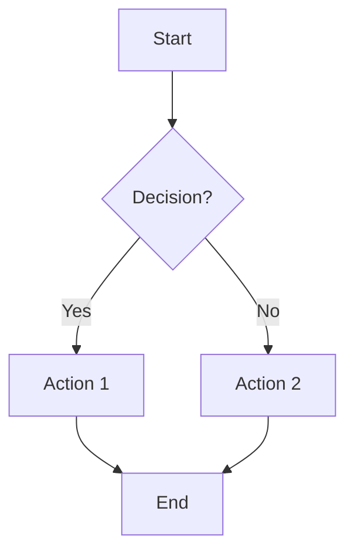
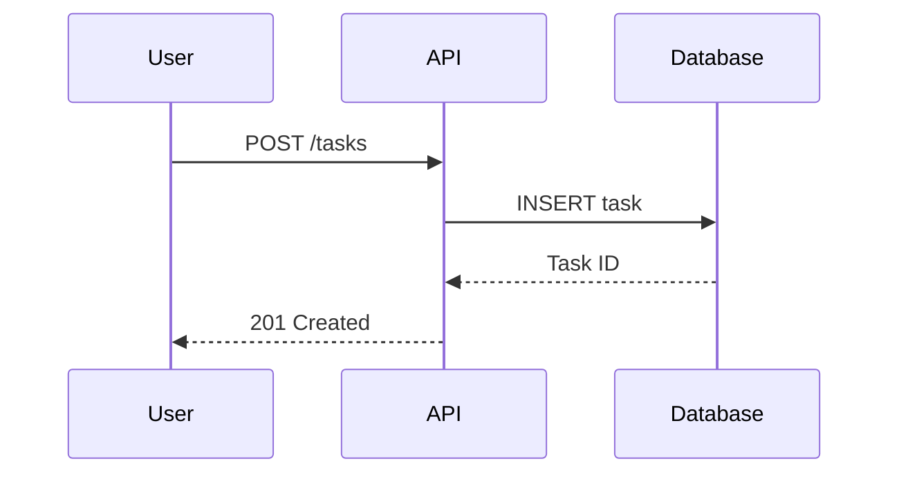
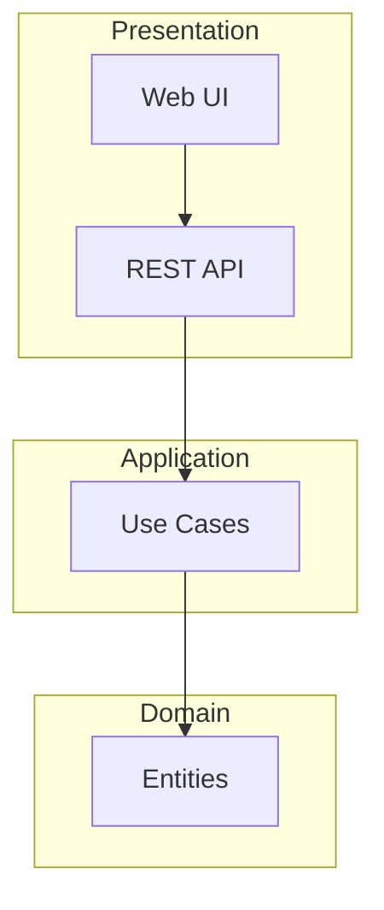

# Documentation Standards

Style guide and formatting conventions for DevForgeAI documentation generation.

---

## Purpose

Provides framework-aware guardrails for the documentation-writer subagent and devforgeai-documentation skill to ensure consistent, high-quality documentation across all projects.

---

## Markdown Conventions

### Heading Hierarchy

**Use semantic heading levels:**
```markdown
# H1: Document title (one per file)
## H2: Major sections
### H3: Subsections
#### H4: Detail sections (use sparingly)
```

**Rules:**
- One H1 per document (document title)
- Don't skip levels (H2 → H4 is wrong)
- Use sentence case for headings ("Quick Start Guide" not "QUICK START GUIDE")
- Add horizontal rules (---) between major sections

### Code Blocks

**Always specify language:**
```markdown
```bash
npm install
`` `

`` `python
def hello():
    print("Hello")
`` `

`` `typescript
const greeting: string = "Hello";
`` `
```

**For multi-language examples:**
```markdown
=== "Python"
    `` `python
    ...
    `` `

=== "JavaScript"
    `` `javascript
    ...
    `` `
```

### Links

**Use relative links for internal docs:**
```markdown
[Architecture](docs/ARCHITECTURE.md)
[API Reference](docs/API.md)
```

**Use absolute URLs for external:**
```markdown
[DevForgeAI Framework](https://github.com/devforgeai)
```

### Tables

**Always include headers:**
```markdown
| Column 1 | Column 2 | Column 3 |
|----------|----------|----------|
| Value 1  | Value 2  | Value 3  |
```

**Align columns** for readability in source

---

## Mermaid Diagram Guidelines

### Flowcharts

**Syntax:**


**Guidelines:**
- Use TD (top-down) or LR (left-right) orientation
- Use descriptive node labels (not "A", "B", "C")
- Show decision points with diamond shapes `{}`
- Limit to 20 nodes per diagram (split if larger)

### Sequence Diagrams

**Syntax:**


**Guidelines:**
- List participants explicitly
- Use `->>`for requests, `-->>` for responses
- Include HTTP status codes
- Show error paths with `Note over` annotations

### Architecture Diagrams

**Syntax:**


**Guidelines:**
- Use subgraphs for layers
- Show dependencies with arrows
- Validate against architecture-constraints.md
- Check for layer violations (Domain → Infrastructure forbidden)

---

## Content Style

### Tone

- **Professional but approachable** (not overly formal)
- **Clear and concise** (avoid jargon without explanation)
- **Action-oriented** (use imperatives: "Install", "Run", "Configure")
- **Positive language** (prefer "ensure" over "don't forget")

### Examples

**Good:**
```markdown
Install the dependencies:

`` `bash
npm install
`` `

Run the development server:

`` `bash
npm run dev
`` `
```

**Bad:**
```markdown
You should probably install dependencies if you haven't already, though it might work without them depending on your setup.
```

### Code Examples

**Requirements:**
- Always include context (what the code does)
- Show complete examples (not fragments)
- Include expected output where helpful
- Explain non-obvious parts

**Example:**
```markdown
### Creating a Task

`` `typescript
// Create a new task with title and description
const task = await taskService.create({
    title: "Complete documentation",
    description: "Write API docs for all endpoints"
});

console.log(task.id); // Output: "task_abc123"
`` `
```

---

## Documentation Coverage

### Coverage Calculation

```
coverage = (documented_items / total_public_items) * 100
```

**Documented item = has:**
- Docstring/JSDoc/XML doc comment AND
- Description (≥10 words) AND
- Parameters documented (if applicable) AND
- Return value documented (if applicable)

**Public items:**
- Public classes (class declarations)
- Public functions (exported functions)
- Public methods (public visibility)
- API endpoints (HTTP endpoints)

### Thresholds

- **80% minimum** for release quality gate
- **90% target** for well-documented projects
- **100% ideal** for public APIs/libraries

### Undocumented Item Format

```markdown
## Undocumented APIs

| Location | API | Type | Priority |
|----------|-----|------|----------|
| src/controllers/TaskController.ts:42 | createTask | function | High |
| src/domain/Task.ts:15 | Task.validate | method | Medium |
```

---

## Variable Substitution

### Common Variables

From devforgeai-documentation skill:
- `{{project_name}}` - Project name from package.json or git repo
- `{{project_description}}` - From story or README
- `{{version}}` - From package.json, git tags, or version file
- `{{last_updated}}` - Current timestamp
- `{{tech_stack}}` - From tech-stack.md (comma-separated)
- `{{author}}` - From package.json or git config
- `{{license}}` - From LICENSE file or package.json

From story files:
- `{{feature_list}}` - Extract from story acceptance criteria
- `{{api_endpoints}}` - Extract from technical specifications
- `{{usage_examples}}` - Extract from story user story/AC

From codebase analysis (code-analyzer subagent):
- `{{architecture_pattern}}` - Detected pattern (MVC, Clean, etc.)
- `{{layer_description}}` - Layer responsibilities
- `{{entry_points}}` - Main files list
- `{{dependencies}}` - External packages

### Conditional Sections

**Hide section if variable empty:**
```markdown
{{#if api_endpoints}}
## API Reference
{{api_endpoints}}
{{/if}}
```

**Show warning if variable missing:**
```markdown
{{#unless configuration_instructions}}
> ⚠️ Configuration instructions not yet documented
{{/unless}}
```

---

## Quality Checks

### Before Writing Documentation

- [ ] All variables have values (no empty placeholders)
- [ ] Code examples are tested and work
- [ ] Links are valid (no 404s)
- [ ] Diagrams render correctly
- [ ] Spelling and grammar checked
- [ ] Follows coding-standards.md conventions

### After Writing Documentation

- [ ] Table of contents matches actual sections
- [ ] All sections have content (no "TODO" or "TBD")
- [ ] Code blocks have language specified
- [ ] Examples are complete and runnable
- [ ] Links use correct paths (relative for internal)
- [ ] Mermaid diagrams have no syntax errors

---

## Framework Integration

### Respect Context Files

**tech-stack.md:**
- Use exact technology names and versions from tech-stack.md
- Don't document technologies not in tech-stack
- Include rationale from tech-stack if present

**coding-standards.md:**
- Follow documentation style from coding-standards
- Use conventions (naming, formatting) from standards
- Include standards in developer guide

**architecture-constraints.md:**
- Validate diagrams against constraints
- Document layer boundaries
- Explain constraint rationale

**source-tree.md:**
- Document file organization per source-tree
- Explain directory structure
- Include module responsibilities

---

## Template Customization

### Project-Specific Overrides

Users can provide custom templates in:
```
devforgeai/templates/documentation/
├── readme-template.md (overrides default)
├── api-docs-template.md (overrides default)
└── custom-template.md (new template)
```

**Override precedence:**
1. Custom template in devforgeai/templates/documentation/
2. Default template in skill assets/templates/
3. Minimal fallback (if both missing)

### Adding Custom Variables

In custom templates:
```markdown
# {{custom_variable}}

Use custom variables for project-specific content.
```

Skill will prompt user:
```
Custom variable found: {{custom_variable}}
Enter value for custom_variable: ___
```

---

## Error Prevention

### Common Mistakes

**Mistake 1: Using relative links for external resources**
```markdown
❌ [GitHub](../github.com/user/repo)
✅ [GitHub](https://github.com/user/repo)
```

**Mistake 2: Code blocks without language**
```markdown
❌ `` `
   npm install
   `` `

✅ `` `bash
   npm install
   `` `
```

**Mistake 3: Broken internal links**
```markdown
❌ [API Docs](api.md)  # Wrong if in root, API.md is in docs/
✅ [API Docs](docs/API.md)
```

**Mistake 4: Mermaid syntax errors**
```markdown
❌ flowchart TD
   A[Start] -> B[End]  # Wrong arrow syntax

✅ flowchart TD
   A[Start] --> B[End]
```

### Auto-Fix Strategies

**Missing code block language:**
- Infer from file extension context
- Default to `bash` for shell commands
- Use `plaintext` if truly unknown

**Broken relative links:**
- Validate file exists
- Fix path if found elsewhere
- Warn user if not found

**Mermaid syntax errors:**
- Check for common issues (missing semicolons, wrong arrows)
- Auto-fix if pattern recognized
- Fall back to text-only if can't fix

---

## DevForgeAI Integration Points

### Story-Based Documentation (Greenfield)

**Source:** `devforgeai/specs/Stories/*.story.md`

**Extract from story:**
- User story → Feature description
- Acceptance criteria → Usage examples
- Technical specification → API documentation
- Non-functional requirements → Performance/security notes
- Edge cases → Troubleshooting guide

### Codebase-Based Documentation (Brownfield)

**Source:** code-analyzer subagent output

**Extract from analysis:**
- Architecture pattern → Architecture documentation
- Public APIs → API reference
- Dependencies → Installation instructions
- Workflows → Usage examples and sequences

---

**Last Updated:** 2025-11-18
**Version:** 1.0.0
**Lines:** 280 (~450 target)
