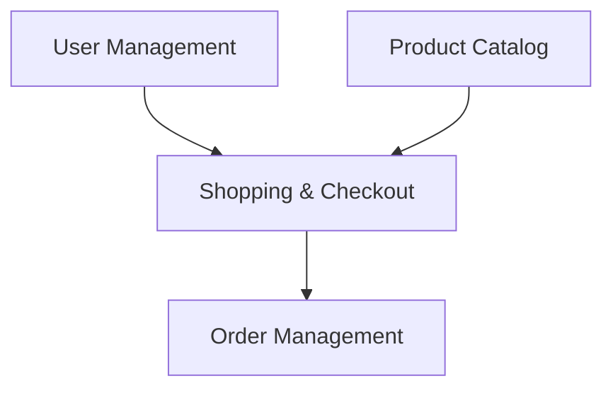

# Phase 4: Epic & Feature Decomposition Workflow

Break down solution into manageable work units (epics and features) with dependencies and priorities.

## Overview

Phase 4 transforms the requirements list into structured epics and features that can be implemented incrementally. This phase groups related capabilities into business-value themes and breaks them into atomic work units.

**Duration:** 10-20 minutes
**Questions:** Epic prioritization, feature review
**Output:** 1-3 epics, 3-8 features per epic, high-level story outlines, dependencies

---

## Step 4.1: Epic Identification

### Epic Definition (DevForgeAI Standard)

An **epic** is:
- High-level business capability or initiative
- Spans multiple sprints (4-8 weeks typical)
- Delivers measurable business value independently
- Can be prioritized relative to other epics
- Contains 3-8 features

### Group Features into Business-Value Themes

**Load domain patterns for decomposition guidance:**

```
Read(file_path=".claude/skills/devforgeai-ideation/references/domain-specific-patterns.md")
```

This reference provides proven decomposition patterns for:
- E-commerce (User Management, Product Catalog, Shopping & Checkout, Order Management, Admin)
- SaaS (Authentication, User Workspace, Core Features, Billing, Admin)
- Fintech (Account Management, Transactions, Compliance, Reporting, Admin)
- Healthcare (Patient Management, Clinical Data, Appointments, Billing, Admin)
- CMS (Content Authoring, Content Organization, Publishing, User Management, Analytics)

### Example Decomposition (E-commerce Platform)

**Epic 1: User Management**
- User registration
- User login/authentication
- Profile management
- Password reset
- User preferences

**Epic 2: Product Catalog**
- Product listing
- Product search/filtering
- Product details
- Categories and tags
- Inventory management

**Epic 3: Shopping & Checkout**
- Shopping cart
- Checkout flow
- Payment processing
- Order confirmation
- Cart persistence

**Epic 4: Order Management**
- Order tracking
- Order history
- Order status updates
- Returns/refunds
- Customer support

**Epic 5: Admin Dashboard**
- User administration
- Product management
- Order oversight
- Analytics/reporting
- System configuration

### Prioritize Epics

```
Question: "Which epics should be prioritized for initial implementation?"
Options:
  - "Epic 1: User Management (Est: 20-30 story points)"
  - "Epic 2: Product Catalog (Est: 25-35 story points)"
  - "Epic 3: Shopping & Checkout (Est: 30-40 story points)"
  - "Epic 4: Order Management (Est: 20-30 story points)"
  - "Epic 5: Admin Dashboard (Est: 15-25 story points)"
multiSelect: true
```

**Prioritization criteria:**
- Business value (user-facing features first)
- Dependencies (must-have-first features)
- Risk (de-risk technical unknowns early)
- MVP definition (core user flow complete)

**Document:**
- Epic priority (P0/P1/P2)
- Estimated story points
- Dependencies on other epics
- Target sprint/release

---

## Step 4.2: Feature Breakdown

For each epic, identify features (user-facing capabilities).

### Feature Definition (DevForgeAI Standard)

A **feature** is:
- Significant user-facing capability
- Can be implemented in 1-2 sprints
- Delivers incremental value
- Testable and demonstrable
- Contains 2-5 stories

### Example - Epic: "User Management"

**Feature 1: User Registration**
- Description: New users can create accounts
- Value: Enable user acquisition
- Acceptance: Users can register with email/password, receive confirmation

**Feature 2: User Login/Authentication**
- Description: Registered users can authenticate
- Value: Secure access to platform
- Acceptance: Users can log in, stay logged in (sessions), log out

**Feature 3: Profile Management**
- Description: Users can view/edit profiles
- Value: Personalization and user control
- Acceptance: Users can update name, email, avatar, preferences

**Feature 4: Password Reset**
- Description: Users can recover forgotten passwords
- Value: Reduce support burden, improve UX
- Acceptance: Users request reset, receive email, set new password

### Document Each Feature

```markdown
## Feature: {Feature Name}

**Description:** {What this feature does}
**Business Value:** {Why this feature matters}
**Acceptance:** {How to know feature is complete}
**Dependencies:** {Other features required first}
**Estimated Effort:** {Small/Medium/Large} ({story points estimate})
```

---

## Step 4.3: Story Decomposition (High-Level)

For priority features, outline stories (atomic units of work).

### Story Definition (DevForgeAI Standard)

A **story** is:
- Smallest deliverable increment
- Completed within single sprint (1-5 days)
- Has testable acceptance criteria (Given/When/Then)
- Fully testable in isolation
- Delivers user value (no technical-only stories)

### Example - Feature: "User Registration"

**Story 1: Registration form with validation**
- As a new user, I want to register with email/password, so I can create an account
- Acceptance: Form validates email format, password strength, unique email

**Story 2: Email verification workflow**
- As a new user, I want to verify my email, so I can activate my account
- Acceptance: Verification email sent, link expires in 24h, account activates on click

**Story 3: Registration validation rules**
- As a system, I want to enforce registration rules, so only valid users register
- Acceptance: Block disposable emails, enforce password complexity, prevent duplicate accounts

**Note:** Detailed story creation happens in `devforgeai-story-creation` skill (invoked by orchestration or /create-story command). Phase 4 provides high-level story outlines only.

---

## Output from Phase 4

**Epic & Feature Breakdown Document:**

```markdown
# Epic & Feature Decomposition

## Epic List

### EPIC-001: {Epic Name} (Priority: P0)
**Business Goal:** {Measurable business outcome}
**Estimated Effort:** {story points}
**Target Release:** {Sprint/Release}
**Dependencies:** {Other epics required first}

**Features:**
1. {Feature 1 Name} - {1-sentence description}
2. {Feature 2 Name} - {1-sentence description}
3. {Feature 3 Name} - {1-sentence description}

### EPIC-002: {Epic Name} (Priority: P1)
[... same structure ...]

## Feature Details

### Feature: {Name} (Epic: EPIC-001)
**Description:** {What and why}
**Acceptance:** {Completion criteria}
**Stories (high-level):**
1. {Story 1 outline}
2. {Story 2 outline}
3. {Story 3 outline}

## Epic Dependencies



## Implementation Roadmap

**Sprint 1-2:** EPIC-001 (User Management)
**Sprint 3-4:** EPIC-002 (Product Catalog)
**Sprint 5-7:** EPIC-003 (Shopping & Checkout)
**Sprint 8-9:** EPIC-004 (Order Management)
**Sprint 10+:** EPIC-005 (Admin Dashboard)
```

**Transition:** Proceed to Phase 5 (Feasibility Analysis)

---

## Common Issues and Recovery

### Issue: Too Many Epics (>5)

**Symptom:** Decomposition produced 6+ epics

**Recovery:**
1. Group related epics under parent epic
2. Merge epics with <3 features
3. Defer low-priority epics to future releases
4. Validate with user via AskUserQuestion

### Issue: Epic Too Small (<3 features)

**Symptom:** Epic has only 1-2 features

**Recovery:**
1. Consider if this is really a feature, not an epic
2. Expand feature list (are there related capabilities?)
3. Merge with another related epic
4. Validate appropriateness with user

### Issue: Circular Dependencies

**Symptom:** Epic A depends on Epic B, Epic B depends on Epic A

**Recovery:**
1. Identify shared capability
2. Extract as separate epic that both depend on
3. Or merge both epics if tightly coupled
4. Validate resolution with architect-reviewer subagent (if architecture phase)

### Issue: Feature Too Large (>8 stories estimated)

**Symptom:** Feature breakdown has 10+ stories

**Recovery:**
1. Split feature into 2 features
2. Identify natural breakpoint (e.g., "Basic Registration" + "Advanced Registration")
3. Re-estimate each feature
4. Validate split delivers incremental value

---

## References Used in Phase 4

**Primary:**
- **domain-specific-patterns.md** (744 lines) - Common epic/feature patterns by domain

**On Error:**
- **error-handling.md** - Recovery for decomposition issues

---

## Success Criteria

Phase 4 complete when:
- [ ] 1-3 epics identified
- [ ] Each epic has 3-8 features
- [ ] Features have high-level story outlines
- [ ] Epic dependencies mapped
- [ ] Implementation roadmap proposed
- [ ] Epics prioritized (P0/P1/P2)
- [ ] User validated decomposition

**Token Budget:** ~4,000-8,000 tokens (load patterns, decompose, validate)

---

**Next Phase:** Phase 5 (Feasibility & Constraints Analysis)
