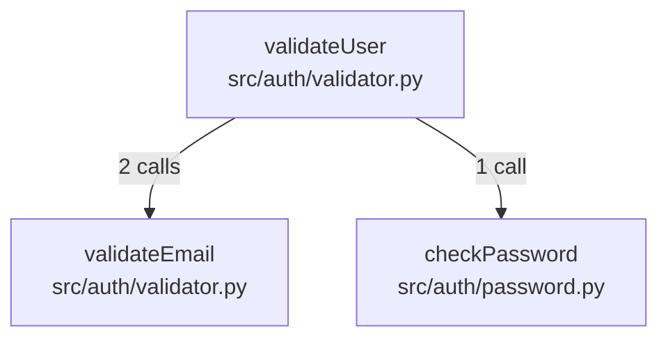
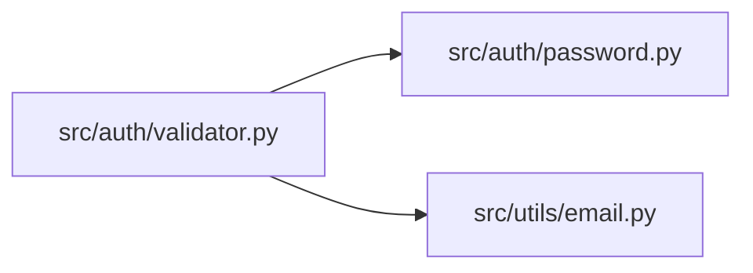

# Epic: Advanced Features - Indexing, Repository Map, Dependencies

## Business Goal

Extend Treelint with production-scale features: background daemon indexing for instant queries, comprehensive repository mapping with relevance scoring, and dependency graph extraction for understanding code relationships.

**Value Proposition:**
- Instant queries via always-fresh daemon index
- Repository-wide symbol overview with PageRank-style relevance
- Call graph and import graph for code navigation
- Full feature parity with Aider's repo map capabilities

## Success Metrics

- **Daemon Uptime:** Daemon runs stably for 8+ hours without issues
- **Incremental Index Speed:** < 1 second to re-index modified file
- **Repo Map Coverage:** 100% of supported language symbols indexed
- **Dependency Graph Accuracy:** ≥ 90% call/import relationships detected
- **Total Feature Completion:** All 6 must-have features from brainstorm delivered

**Measurement Plan:**
- Daemon stability: Long-running test sessions
- Index speed: Benchmark file modification → query freshness
- Coverage: Compare Treelint map vs manual symbol count
- Accuracy: Sample 50 functions, verify call relationships

## Scope

### In Scope

1. **Feature F4: Background Indexing**
   - Daemon architecture with IPC (Unix socket)
   - File watcher integration (notify crate)
   - Incremental index updates (only modified files)
   - `treelint daemon start/stop/status` commands
   - `treelint index` manual command with progress bar
   - Auto-detection: query daemon if running, else on-demand index

2. **Feature F5: Repository Map**
   - `treelint map` command for full symbol listing
   - Symbol hierarchy output (by file, by type)
   - PageRank-style reference counting
   - Relevance score integration (`--ranked` flag)
   - Configurable output detail level

3. **Feature F6: Dependency Graph**
   - Import/export relationship extraction
   - Function call detection (tree-sitter queries)
   - Graph output formats (JSON, Mermaid)
   - `treelint deps --calls` for call graph
   - `treelint deps --imports` for import graph

### Out of Scope

- ❌ IDE/Editor integration
- ❌ GUI interface
- ❌ Additional languages beyond v1 set
- ❌ Remote/cloud indexing
- ❌ Multi-repository support

---

## Technical Specification

> **CRITICAL FOR STORY CREATION:** This section contains exact specifications required for acceptance criteria. Stories MUST reference these specs.

### CLI Interface Specification

```bash
# Daemon management
treelint daemon start              # Start background daemon
treelint daemon stop               # Stop running daemon
treelint daemon status             # Check daemon status (running/stopped, PID, uptime)

# Manual indexing
treelint index                     # Build/rebuild index (shows progress if >1000 files)
treelint index --force             # Force full re-index (ignore file hashes)

# Repository map
treelint map                       # Output all symbols (JSON by default)
treelint map --format text         # Human-readable symbol tree
treelint map --ranked              # Include relevance scores (PageRank-style)
treelint map --type function       # Filter to specific symbol type

# Dependency graph
treelint deps --calls              # Function call graph
treelint deps --imports            # Import/export graph
treelint deps --format json        # JSON output (default)
treelint deps --format mermaid     # Mermaid diagram output
treelint deps --symbol foo         # Graph for specific symbol
```

### Daemon Protocol Specification

**IPC Transport:**
- **Unix/macOS:** Unix domain socket at `.treelint/daemon.sock`
- **Windows:** Named pipe at `\\.\pipe\treelint-daemon`

**Message Format:** Newline-delimited JSON (NDJSON)

```json
// Request (client → daemon)
{"id": "req-001", "method": "search", "params": {"symbol": "foo", "type": "function"}}
{"id": "req-002", "method": "status", "params": {}}
{"id": "req-003", "method": "index", "params": {"force": true}}

// Response (daemon → client)
{"id": "req-001", "result": {"symbols": [...]}, "error": null}
{"id": "req-002", "result": {"status": "ready", "indexed_files": 1500, "uptime_seconds": 3600}, "error": null}
{"id": "req-001", "result": null, "error": {"code": "E001", "message": "Index not ready"}}
```

**Daemon Status Response:**
```json
{
  "status": "ready",           // "starting" | "ready" | "indexing" | "stopping"
  "indexed_files": 1500,
  "indexed_symbols": 45000,
  "last_index_time": "2026-01-27T10:30:00Z",
  "uptime_seconds": 3600,
  "pid": 12345,
  "socket_path": ".treelint/daemon.sock"
}
```

### Auto-Detection Logic

```
treelint search foo
    │
    ├── Check: Is daemon socket/pipe available?
    │   ├── YES → Query daemon (fastest, ~5ms)
    │   └── NO  → Check: Does index.db exist and is fresh?
    │       ├── YES → Query index directly (~20ms)
    │       └── NO  → Build index on-demand, then query (~5-60s first time)
```

### Progress Bar Behavior

**When to show progress:**
- File count > 1000 files
- stdout is TTY (no progress when piped)

**Progress format:**
```
Indexing repository...
[████████████████░░░░░░░░░░░░░░] 54% (54,231/100,000 files)
  Current: src/modules/auth/validators/email.py
  Speed: 1,247 files/sec
  ETA: 37 seconds

✓ Indexed 100,000 files in 1m 23s
  Symbols: 847,293
  Index size: 124 MB
```

### Repository Map Output

**JSON format (`treelint map --format json`):**
```json
{
  "total_symbols": 847,
  "total_files": 150,
  "by_file": {
    "src/auth/validator.py": {
      "language": "python",
      "symbols": [
        {"name": "validateUser", "type": "function", "lines": [10, 45], "relevance": 0.85},
        {"name": "validateEmail", "type": "function", "lines": [47, 62], "relevance": 0.72}
      ]
    }
  },
  "by_type": {
    "function": 523,
    "class": 87,
    "method": 201,
    "variable": 36
  }
}
```

**Text format (`treelint map --format text`):**
```
Repository Map (847 symbols in 150 files)
═══════════════════════════════════════════

src/auth/
├── validator.py (Python)
│   ├── validateUser (function) [10-45] ★ 0.85
│   ├── validateEmail (function) [47-62] ★ 0.72
│   └── UserValidator (class) [64-120] ★ 0.68
├── service.py (Python)
│   └── AuthService (class) [1-89] ★ 0.91

src/index/
├── storage.rs (Rust)
│   ├── SqliteStorage (struct) [15-45]
│   └── impl Storage for SqliteStorage [47-120]
```

### Dependency Graph Output

**JSON format (`treelint deps --calls --format json`):**
```json
{
  "graph_type": "calls",
  "nodes": [
    {"id": "validateUser", "file": "src/auth/validator.py", "type": "function"},
    {"id": "validateEmail", "file": "src/auth/validator.py", "type": "function"},
    {"id": "checkPassword", "file": "src/auth/password.py", "type": "function"}
  ],
  "edges": [
    {"from": "validateUser", "to": "validateEmail", "count": 2},
    {"from": "validateUser", "to": "checkPassword", "count": 1}
  ]
}
```

**Mermaid format (`treelint deps --calls --format mermaid`):**


**Import graph (`treelint deps --imports --format mermaid`):**


### PageRank-Style Relevance Scoring

**Algorithm:** Simple reference counting (not full PageRank)

```
relevance_score = (incoming_references + 1) / (total_symbols)

Where:
- incoming_references = count of other symbols that call/import this symbol
- Normalized to 0.0 - 1.0 range
- Stored in symbols.relevance_score column
```

### File Path Mappings (per source-tree.md)

| Component | File Path | Responsibility |
|-----------|-----------|----------------|
| Daemon server | `src/daemon/server.rs` | IPC listener, request routing |
| File watcher | `src/daemon/watcher.rs` | notify integration |
| IPC protocol | `src/daemon/protocol.rs` | JSON message parsing |
| Index command | `src/cli/commands/index.rs` | Manual indexing |
| Daemon command | `src/cli/commands/daemon.rs` | Daemon management |
| Map command | `src/cli/commands/map.rs` | Repository map |
| Deps command | `src/cli/commands/deps.rs` | Dependency graph |
| Relevance scoring | `src/index/relevance.rs` | PageRank calculation |
| Call graph | `src/graph/calls.rs` | Function call detection |
| Import graph | `src/graph/imports.rs` | Import relationship extraction |
| Mermaid output | `src/output/graph.rs` | Mermaid diagram generation |

### Crate Dependencies (per dependencies.md)

| Feature | Crate | Version |
|---------|-------|---------|
| File watching | notify | 6.1 |
| Progress bars | indicatif | 0.17 |
| IPC | interprocess | 2.0 |
| Colored output | colored | 2.1 |

### Platform-Specific Behavior

| Platform | IPC Transport | Socket/Pipe Path |
|----------|---------------|------------------|
| Linux | Unix socket | `.treelint/daemon.sock` |
| macOS | Unix socket | `.treelint/daemon.sock` |
| Windows | Named pipe | `\\.\pipe\treelint-daemon` |

**Cross-platform abstraction via `interprocess` crate.**

---

## Target Sprints

### Sprint 2 (SPRINT-002): Advanced Features
**Goal:** Deliver daemon indexing, repository map, and dependency graph
**Estimated Points:** 29
**Duration:** Week 2 (5-7 days)

**Features:**
- F4: Background Indexing (13 points)
  - Daemon architecture (IPC socket)
  - File watcher integration
  - Incremental index updates
  - Daemon management commands
  - Manual index command with progress
  - Auto-detection logic
- F5: Repository Map (8 points)
  - Map generation command
  - Symbol hierarchy output
  - PageRank reference counting
  - Relevance score integration
- F6: Dependency Graph (8 points)
  - Import/export relationship extraction
  - Function call detection
  - Graph output formats
  - Deps command

**Key Deliverables:**
- `treelint daemon start/stop/status` working
- `treelint map` with relevance scores
- `treelint deps --calls/--imports` working
- Cross-platform testing complete
- v1.0 release

## User Stories

### Created Stories

| Story ID | Title | Points | Status | Feature |
|----------|-------|--------|--------|---------|
| [STORY-007](../Stories/STORY-007-daemon-core-ipc.story.md) | Daemon Core Architecture with IPC | 5 | Backlog | F4.1 |
| [STORY-008](../Stories/STORY-008-file-watcher-incremental-index.story.md) | File Watcher and Incremental Index Updates | 5 | Backlog | F4.2 |
| [STORY-009](../Stories/STORY-009-daemon-cli-commands.story.md) | Daemon CLI Commands and Auto-Detection | 3 | Backlog | F4.3 |
| [STORY-010](../Stories/STORY-010-repository-map.story.md) | Repository Map with Symbol Hierarchy and Relevance Scoring | 8 | Backlog | F5 |
| [STORY-011](../Stories/STORY-011-dependency-graph.story.md) | Dependency Graph with Call and Import Extraction | 8 | Backlog | F6 |

### Planned Stories (Not Yet Created)

*All features have stories created.*

### High-Level User Stories

1. **As a** developer, **I want** a background daemon that keeps the index fresh, **so that** my queries are always instant
2. **As an** AI coding assistant, **I want** a repository map showing all symbols, **so that** I can understand codebase structure
3. **As an** AI coding assistant, **I want** relevance-ranked symbols, **so that** I prioritize important code
4. **As a** developer, **I want** to see which functions call which, **so that** I can understand code flow
5. **As an** AI coding assistant, **I want** import/export graphs, **so that** I can trace module dependencies

## Technical Considerations

### Architecture Impact
- **New Components:**
  - Daemon process with IPC
  - File watcher service
  - Graph analyzer
  - Relevance scorer (PageRank)
- **Changes:** CLI must detect daemon, fall back to on-demand

### Technology Decisions
- **File Watching:** notify crate (cross-platform inotify/FSEvents/ReadDirectoryChangesW)
- **IPC:** Unix socket (cross-platform via interprocess crate)
- **Graph Algorithm:** Simple reference counting (PageRank-style)
- **Progress Bar:** indicatif crate

### Security & Compliance
- Daemon runs with user permissions only
- Socket protected by filesystem permissions
- No network access

### Performance Requirements
- Daemon idle CPU: < 0.1%
- File change → index update: < 1 second
- Map generation: < 10 seconds for 100K file repo
- Deps extraction: < 30 seconds for 100K file repo

## Dependencies

### Internal Dependencies
- [x] **EPIC-001:** Core CLI Foundation
  - **Status:** Planned (must complete first)
  - **Impact if delayed:** Cannot start F4/F5/F6 without search foundation

### External Dependencies
- [ ] **notify crate:** File watching
  - **Owner:** notify-rs community
  - **Status:** Available (published crate)
- [ ] **indicatif crate:** Progress bars
  - **Owner:** indicatif community
  - **Status:** Available (published crate)

## Risks & Mitigation

### Risk 1: Daemon IPC Complexity
- **Probability:** Medium
- **Impact:** Low
- **Mitigation:** Start with simple Unix socket; proven pattern
- **Contingency:** Fall back to file-based IPC if needed

### Risk 2: File Watcher Platform Differences
- **Probability:** Medium
- **Impact:** Medium
- **Mitigation:** Use notify crate (abstracts platform differences)
- **Contingency:** Manual index refresh as fallback

### Risk 3: PageRank Performance on Large Repos
- **Probability:** Low
- **Impact:** Low
- **Mitigation:** Simple reference counting, not full PageRank
- **Contingency:** Limit to top N symbols if slow

### Risk 4: Timeline Slip
- **Probability:** Medium
- **Impact:** Medium
- **Mitigation:** F6 (dep graph) is lowest priority, can defer to v1.1
- **Contingency:** Ship EPIC-001 + F4 + F5, defer F6

## Stakeholders

### Primary Stakeholders
- **Product Owner:** Bryan - Requirements, prioritization
- **Tech Lead:** Bryan - Architecture, implementation

## Communication Plan

### Status Updates
- **Frequency:** Daily
- **Format:** Commit messages, story updates

### Milestones
- Day 1-3: Daemon and file watcher
- Day 4: Repository map
- Day 5-6: Dependency graph
- Day 7: Cross-platform testing, release

## Timeline

```
Epic Timeline:
════════════════════════════════════════════════════
Day 1-3:  F4 - Background indexing daemon
Day 4:    F5 - Repository map
Day 5-6:  F6 - Dependency graph
Day 7:    Cross-platform testing, v1.0 release
════════════════════════════════════════════════════
Total Duration: 7 days
Target Release: v1.0.0
```

### Key Milestones
- [ ] **Day 3:** Daemon with file watcher working
- [ ] **Day 4:** Repository map with relevance scores
- [ ] **Day 6:** Dependency graph extraction
- [ ] **Day 7:** v1.0.0 release (Full MVP)

## Progress Tracking

### Sprint Summary

| Sprint | Status | Points | Stories | Completed | In Progress | Blocked |
|--------|--------|--------|---------|-----------|-------------|---------|
| SPRINT-002 | Not Started | 29 | TBD | 0 | 0 | 0 |
| **Total** | **0%** | **29** | **TBD** | **0** | **0** | **0** |

### Burndown
- **Total Points:** 29
- **Completed:** 0
- **Remaining:** 29
- **Velocity:** TBD

## Retrospective (Post-Epic)

*To be completed after epic completes*

---

**Epic Template Version:** 1.0
**Last Updated:** 2026-01-27
