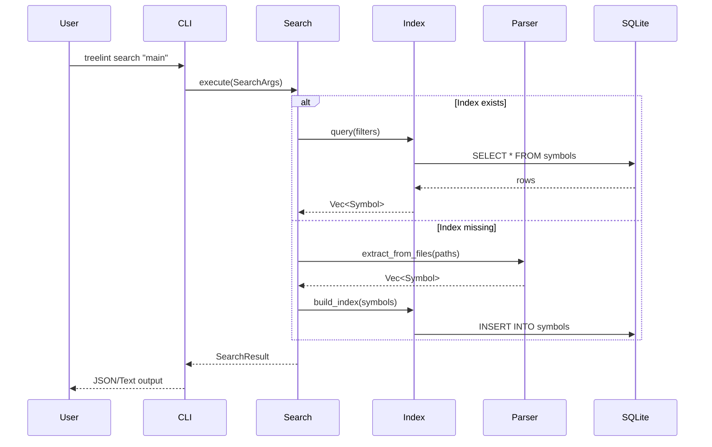
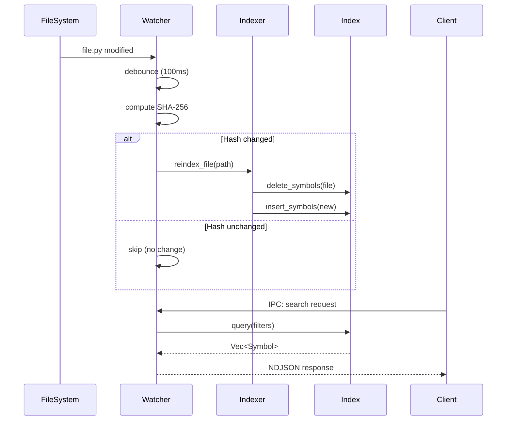

# Treelint Architecture

Comprehensive architecture documentation for Treelint v0.8.0.

---

## Overview

Treelint is an AST-aware code search CLI that uses tree-sitter to return semantic code units (functions, classes) instead of raw text matches. It reduces AI coding assistant token consumption by 40-80%.

**Architecture Pattern:** Modular Monolith (Tier 2)
**Primary Language:** Rust 2021
**Codebase Size:** ~7,300 lines of Rust

---

## High-Level Architecture

```
┌─────────────────────────────────────────────────────────────────────────┐
│                              Treelint CLI                                │
│                           (treelint binary)                              │
├─────────────────────────────────────────────────────────────────────────┤
│                                                                         │
│  ┌─────────────┐   ┌─────────────┐   ┌─────────────┐   ┌─────────────┐ │
│  │    CLI      │   │   Parser    │   │    Index    │   │   Daemon    │ │
│  │   Layer     │   │   Module    │   │   Module    │   │   Module    │ │
│  │  (clap)     │   │(tree-sitter)│   │  (SQLite)   │   │   (IPC)     │ │
│  └──────┬──────┘   └──────┬──────┘   └──────┬──────┘   └──────┬──────┘ │
│         │                 │                 │                 │         │
│         └─────────────────┼─────────────────┼─────────────────┘         │
│                           │                 │                           │
│                    ┌──────┴──────┐   ┌──────┴──────┐                   │
│                    │   Output    │   │   Error     │                   │
│                    │   Module    │   │   Module    │                   │
│                    │ (JSON/Text) │   │ (thiserror) │                   │
│                    └─────────────┘   └─────────────┘                   │
│                                                                         │
├─────────────────────────────────────────────────────────────────────────┤
│                       Embedded Dependencies                              │
│  ┌────────────────┐  ┌────────────────┐  ┌────────────────┐            │
│  │  tree-sitter   │  │    SQLite      │  │    notify      │            │
│  │   Grammars     │  │   (bundled)    │  │  (file watch)  │            │
│  │ (Py,TS,Rs,Md)  │  │                │  │                │            │
│  └────────────────┘  └────────────────┘  └────────────────┘            │
└─────────────────────────────────────────────────────────────────────────┘
```

---

## Layer Architecture

Treelint follows a strict 4-layer architecture with downward-only dependencies:

```
┌─────────────────────────────────────────────────────────────────────────┐
│                           CLI Layer                                      │
│                    src/cli/, src/main.rs                                 │
│         clap argument parsing, command routing, TTY detection            │
├─────────────────────────────────────────────────────────────────────────┤
│                       Application Layer                                  │
│                     src/cli/commands/                                    │
│          Command implementations, workflow coordination                  │
├─────────────────────────────────────────────────────────────────────────┤
│                         Domain Layer                                     │
│              src/parser/, src/index/, src/output/                        │
│      Symbol extraction, search algorithms, output formatting             │
├─────────────────────────────────────────────────────────────────────────┤
│                      Infrastructure Layer                                │
│           src/index/storage.rs, src/daemon/, tree-sitter                │
│     SQLite operations, file system, IPC, tree-sitter bindings           │
└─────────────────────────────────────────────────────────────────────────┘
```

### Layer Rules

| Layer | Can Call | Cannot Call |
|-------|----------|-------------|
| CLI | Application, Domain, Infrastructure | - |
| Application | Domain, Infrastructure | CLI |
| Domain | Infrastructure | CLI, Application |
| Infrastructure | - | CLI, Application, Domain |

---

## Module Structure

```
src/
├── main.rs              # Entry point (20 lines)
├── lib.rs               # Library exports (14 lines)
├── error.rs             # Error types (37 lines)
│
├── cli/                 # CLI Layer
│   ├── mod.rs           # Module exports
│   ├── args.rs          # Clap argument definitions (156 lines)
│   └── commands/
│       ├── mod.rs       # Command routing
│       └── search.rs    # Search command (256 lines)
│
├── parser/              # Domain: AST Parsing
│   ├── mod.rs           # Module exports
│   ├── languages.rs     # Language detection (198 lines)
│   ├── symbols.rs       # Symbol extraction (1,933 lines) ⚠️
│   ├── context.rs       # Context modes (322 lines)
│   └── queries/
│       ├── mod.rs       # Query routing
│       ├── python.rs    # Python queries
│       ├── typescript.rs # TypeScript queries
│       ├── rust.rs      # Rust queries
│       └── markdown.rs  # Markdown queries
│
├── index/               # Domain: Symbol Storage
│   ├── mod.rs           # Module exports
│   ├── schema.rs        # DB schema (231 lines)
│   ├── search.rs        # Query execution (256 lines)
│   └── storage.rs       # SQLite operations (1,203 lines) ⚠️
│
├── daemon/              # Infrastructure: Background Service
│   ├── mod.rs           # Module exports, DaemonState
│   ├── server.rs        # IPC server (1,224 lines) ⚠️
│   ├── protocol.rs      # NDJSON protocol (117 lines)
│   └── watcher.rs       # File watcher (1,097 lines) ⚠️
│
└── output/              # Domain: Output Formatting
    ├── mod.rs           # Module exports
    ├── json.rs          # JSON formatter (130 lines)
    └── text.rs          # Text formatter (141 lines)

Total: ~7,300 lines
⚠️ = Modules exceeding 500-line guideline (candidates for refactoring)
```

---

## Data Flow

### Search Command Flow



### Daemon + File Watcher Flow


---

## Key Components

### Parser Module (`src/parser/`)

**Purpose:** Extract semantic symbols from source code using tree-sitter.

| Component | Responsibility |
|-----------|----------------|
| `Language` | Language detection from file extensions |
| `Parser` | tree-sitter wrapper for parsing |
| `SymbolExtractor` | Extract Symbol structs from AST |
| `ContextMode` | Control output granularity (full/lines/signatures) |

**Supported Languages:**

| Language | Grammar | File Extensions |
|----------|---------|-----------------|
| Python | tree-sitter-python | `.py` |
| TypeScript | tree-sitter-typescript | `.ts`, `.tsx`, `.js`, `.jsx` |
| Rust | tree-sitter-rust | `.rs` |
| Markdown | tree-sitter-md | `.md`, `.markdown` |

### Index Module (`src/index/`)

**Purpose:** Persist and query symbols using SQLite.

| Component | Responsibility |
|-----------|----------------|
| `IndexStorage` | CRUD operations on SQLite |
| `QueryFilters` | Build query predicates |
| `Schema` | Database schema versioning |

**Database Schema:**

```sql
CREATE TABLE symbols (
    id INTEGER PRIMARY KEY,
    name TEXT NOT NULL,
    symbol_type TEXT NOT NULL,
    visibility TEXT,
    file_path TEXT NOT NULL,
    line_start INTEGER NOT NULL,
    line_end INTEGER NOT NULL,
    signature TEXT,
    body TEXT,
    language TEXT NOT NULL,
    file_hash TEXT
);

CREATE INDEX idx_symbols_name ON symbols(name);
CREATE INDEX idx_symbols_file ON symbols(file_path);
```

### Daemon Module (`src/daemon/`)

**Purpose:** Background service for instant queries via IPC.

| Component | Responsibility |
|-----------|----------------|
| `DaemonServer` | IPC server (Unix socket/Named pipe) |
| `Protocol` | NDJSON request/response format |
| `FileWatcher` | Cross-platform file monitoring |
| `IncrementalIndexer` | Single-file re-indexing |
| `HashCache` | SHA-256 change detection |

**IPC Protocol:**

```json
// Request
{"id": "1", "method": "search", "params": {"symbol": "main"}}

// Response
{"id": "1", "result": [...], "error": null}
```

### Output Module (`src/output/`)

**Purpose:** Format search results for display.

| Component | Responsibility |
|-----------|----------------|
| `JsonFormatter` | Structured JSON for AI tools |
| `TextFormatter` | Human-readable terminal output |

**Auto-Detection:** TTY = text, pipe = JSON

---

## Cross-Cutting Concerns

### Error Handling

All errors flow through `TreelintError`:

```rust
#[derive(Debug, thiserror::Error)]
pub enum TreelintError {
    #[error("I/O error: {0}")]
    Io(#[from] std::io::Error),

    #[error("Parse error: {0}")]
    Parse(String),

    #[error("Storage error: {0}")]
    Storage(#[from] rusqlite::Error),

    #[error("CLI error: {0}")]
    Cli(String),
}
```

### Concurrency

| Component | Strategy |
|-----------|----------|
| SQLite | WAL mode for concurrent reads |
| Daemon | Single writer, multiple readers |
| FileWatcher | Event queue with mutex |

### Performance Targets

| Metric | Target | Achieved |
|--------|--------|----------|
| Query latency (CLI) | < 50ms | ~5ms (indexed) |
| Query latency (daemon) | < 5ms | ~2ms |
| File change → index | < 1s | ~200ms |
| Binary size | < 50MB | 7.6MB |

---

## Deployment Architecture

```
┌─────────────────────────────────────────────────────────────────────────┐
│                         User's Machine                                   │
├─────────────────────────────────────────────────────────────────────────┤
│                                                                         │
│  ┌─────────────────┐          ┌─────────────────────────────────────┐  │
│  │  AI Assistant   │          │         treelint daemon              │  │
│  │ (Claude Code)   │◄────────►│  ┌─────────────────────────────┐    │  │
│  └─────────────────┘   IPC    │  │      File Watcher           │    │  │
│                               │  │   (notify: inotify/FSEvents) │    │  │
│  ┌─────────────────┐          │  └──────────────┬──────────────┘    │  │
│  │  treelint CLI   │          │                 │                    │  │
│  │ (one-off search)│          │  ┌──────────────▼──────────────┐    │  │
│  └────────┬────────┘          │  │    Incremental Indexer      │    │  │
│           │                   │  │   (single-file re-parse)    │    │  │
│           │                   │  └──────────────┬──────────────┘    │  │
│           │                   │                 │                    │  │
│           │                   └─────────────────┼────────────────────┘  │
│           │                                     │                       │
│           └─────────────────────┬───────────────┘                       │
│                                 │                                       │
│                    ┌────────────▼────────────┐                         │
│                    │  .treelint/index.db     │                         │
│                    │      (SQLite)           │                         │
│                    └─────────────────────────┘                         │
│                                                                         │
│  ┌─────────────────────────────────────────────────────────────────┐   │
│  │                     Project Codebase                             │   │
│  │   *.py  *.ts  *.tsx  *.rs  *.md  (monitored by file watcher)    │   │
│  └─────────────────────────────────────────────────────────────────┘   │
│                                                                         │
└─────────────────────────────────────────────────────────────────────────┘
```

---

## Technology Stack

| Category | Technology | Version | Rationale |
|----------|------------|---------|-----------|
| Language | Rust | 2021 | Single binary, memory safety |
| Parser | tree-sitter | 0.22 | Incremental parsing, 100+ languages |
| Database | SQLite | 0.31 (rusqlite) | Portable, zero-config |
| CLI | clap | 4.5 | Industry standard |
| File Watch | notify | 6.1 | Cross-platform |
| Hashing | sha2 | 0.10 | SHA-256 for change detection |
| Serialization | serde + serde_json | 1.0 | De-facto standard |
| Error Handling | thiserror + anyhow | 1.0 | Ergonomic errors |

---

## Architecture Decision Records (ADRs)

| ADR | Title | Status | Summary |
|-----|-------|--------|---------|
| [ADR-001](../../devforgeai/specs/adrs/ADR-001-initial-architecture.md) | Initial Architecture | Accepted | Rust + tree-sitter + SQLite |
| [ADR-002](../../devforgeai/specs/adrs/ADR-002-sha2-crate-for-file-hashing.md) | SHA-256 Hashing | Accepted | sha2 crate for file change detection |

---

## Security Considerations

| Area | Implementation |
|------|----------------|
| File Access | Read-only for parsing, write to .treelint/ only |
| IPC Security | Unix socket (0600 permissions) / Named pipe (DACL) |
| SQL Injection | Parameterized queries only |
| Input Validation | File paths validated, regex sanitized |

---

## Future Considerations

1. **Repository Map** - Generate symbol summaries (Aider-style)
2. **Dependency Graph** - Track function call relationships
3. **Additional Languages** - C, C++, Java, Go
4. **Remote Index** - Centralized indexing for large codebases
5. **LSP Integration** - Language Server Protocol support

---

## Related Documentation

- [CLI Reference](../api/cli-reference.md)
- [Daemon API Reference](../api/daemon-api.md)
- [Library Reference](../api/library-reference.md)
- [Architecture Constraints](../../devforgeai/specs/context/architecture-constraints.md)
- [Tech Stack](../../devforgeai/specs/context/tech-stack.md)

---

**Version:** 0.8.0
**Generated:** 2026-01-30
**Source:** ADR-001, STORY-001 through STORY-008
