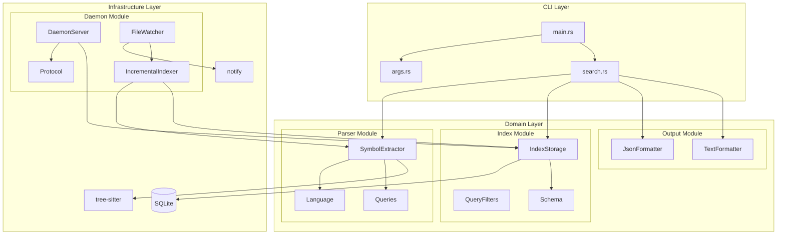
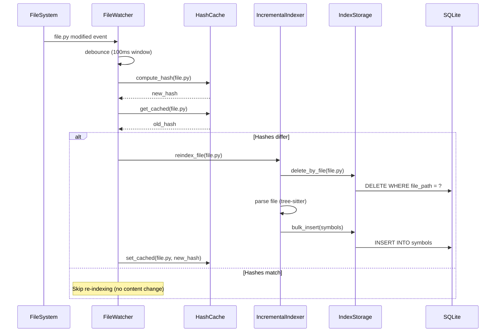
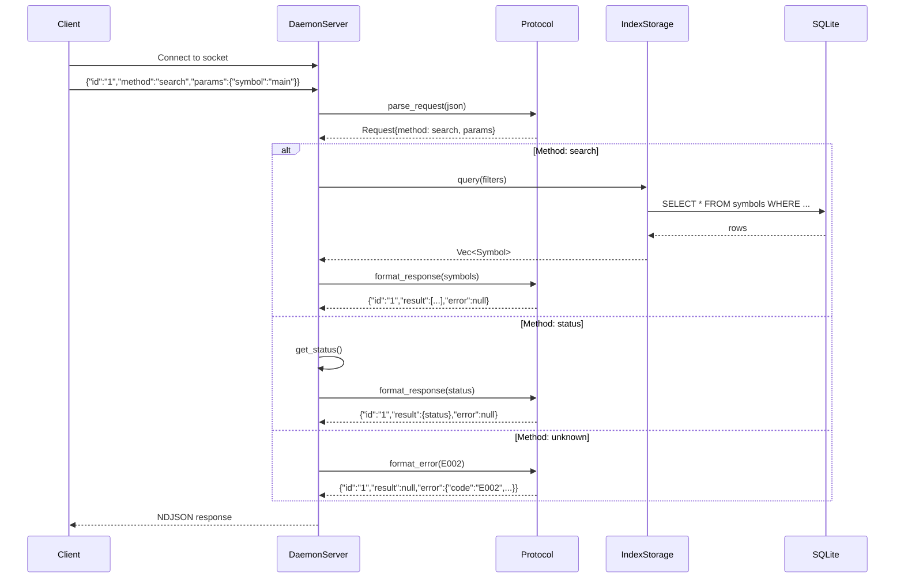
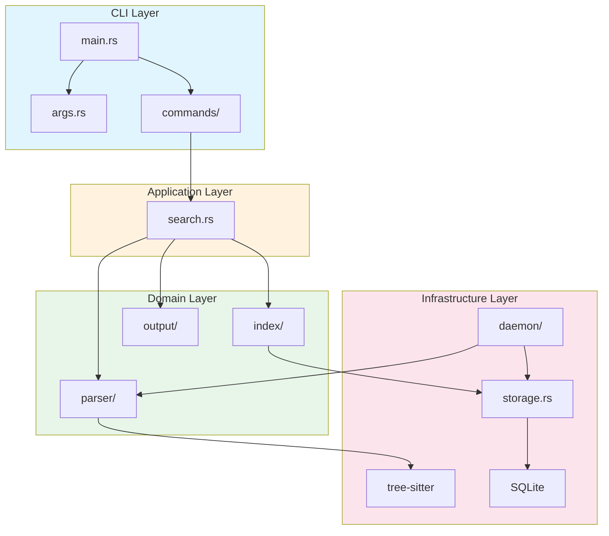
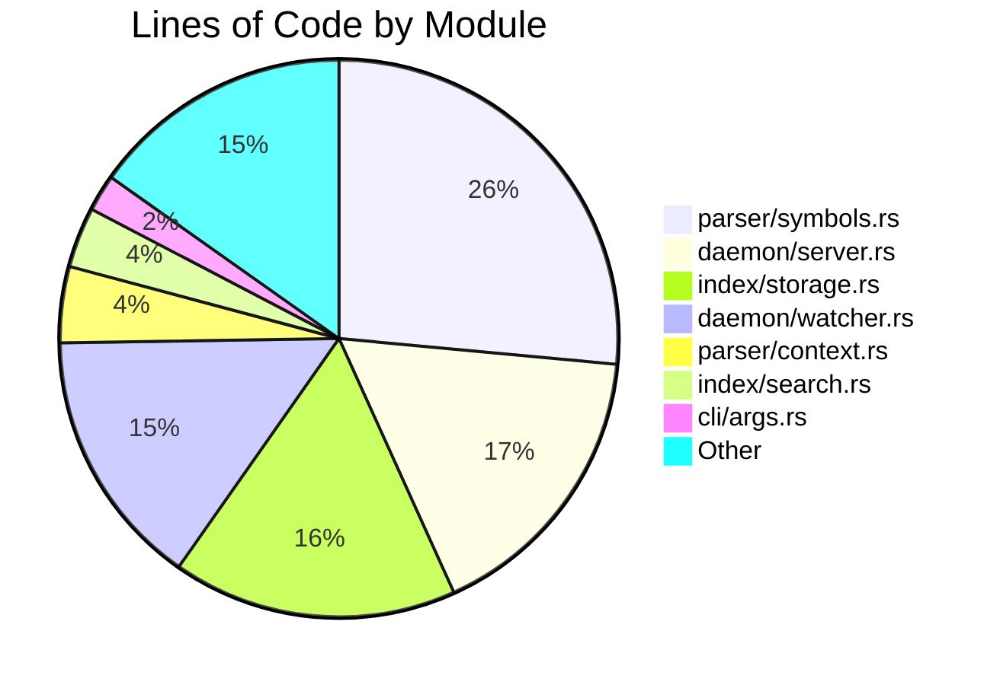
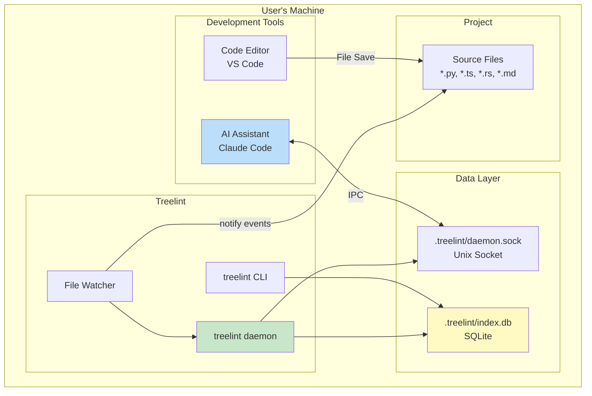
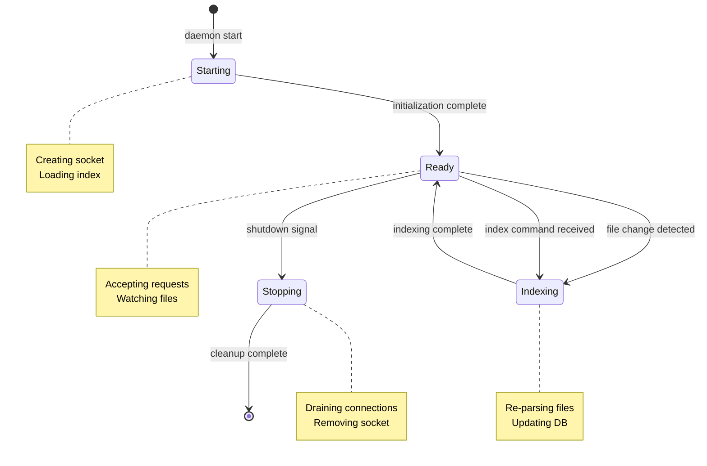

# Treelint Architecture Diagrams

Mermaid diagrams for Treelint architecture visualization.

---

## Component Diagram


---

## Data Flow: Search Command

```mermaid
sequenceDiagram
    participant User
    participant CLI as CLI (main.rs)
    participant Cmd as SearchCommand
    participant Idx as IndexStorage
    participant Par as SymbolExtractor
    participant DB as SQLite

    User->>CLI: treelint search "validateUser"
    CLI->>Cmd: execute(SearchArgs)

    Cmd->>Idx: has_index()?
    Idx->>DB: SELECT count(*) FROM symbols

    alt Index exists
        DB-->>Idx: count > 0
        Idx-->>Cmd: true
        Cmd->>Idx: query(filters)
        Idx->>DB: SELECT * FROM symbols WHERE name LIKE ?
        DB-->>Idx: rows
        Idx-->>Cmd: Vec<Symbol>
    else Index missing
        DB-->>Idx: count = 0
        Idx-->>Cmd: false
        Cmd->>Par: extract_from_directory(.)
        Par-->>Cmd: Vec<Symbol>
        Cmd->>Idx: bulk_insert(symbols)
        Idx->>DB: INSERT INTO symbols
    end

    Cmd-->>CLI: SearchResult
    CLI-->>User: JSON/Text output
```

---

## Data Flow: Daemon File Watcher



---

## Data Flow: Daemon IPC Request



---

## Layer Dependency Diagram



---

## Module Size Distribution



---

## Deployment Diagram



---

## State Machine: Daemon States



---

**Version:** 0.8.0
**Generated:** 2026-01-30
